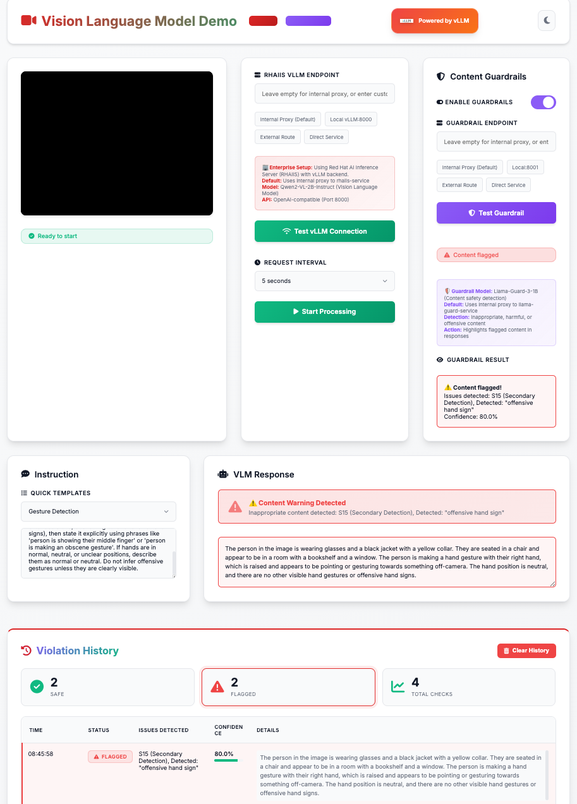

# Vision Language Model Real-time Camera Demo



This repository is a modern demo for how to use vLLM, a high-performance AI inference engine, to serve multiple models for real-time vision language understanding. The demo uses **Qwen2-VL-2B-Instruct** for vision analysis and **Llama-Guard-3-8B** for content safety, providing a beautiful, responsive web interface that captures camera frames and sends them to the AI models for analysis.

## Features

- 🎥 **Real-time camera feed processing** with smart endpoint detection
- 🎨 **Modern, responsive UI** with dark/light mode toggle
- 🤖 **Customizable AI instructions** with preset options
- ⏱️ **Adjustable frame capture intervals** (100ms to 2s)
- 🌐 **Web-based interface** with professional styling
- 🚀 **Multiple deployment options** (local, container, OpenShift)
- 📱 **Mobile-friendly design** with touch support
- ⌨️ **Keyboard shortcuts** (Spacebar to start/stop, Escape to stop)
- 🔧 **Smart API endpoint management** with preset buttons

## Deployment Options

Choose the deployment method that best fits your needs:

### 🖥️ Local Development Setup

For local development, we recommend deploying directly to OpenShift or using the container deployment below. vLLM requires CUDA and significant resources for optimal performance.

---

### 🐳 Container Deployment with vLLM

For local or development environments, deploy using containers with vLLM backend. This deployment serves multiple models for vision analysis and content safety.

#### Prerequisites
- Podman or Docker with GPU support
- NVIDIA GPU with CUDA drivers
- 12GB+ GPU memory (for running both models)
- 16GB+ system RAM recommended

#### Quick Start

```bash
# Start the web container (frontend)
podman run -d -p 8000:8000 --name vlm-web quay.io/rh_ee_micyang/vlm-web:latest

# Access the demo
# Open http://localhost:8000 in your browser
```

**Note**: For production use with GPU acceleration and multiple models, use the OpenShift deployment below.

#### Container Architecture
- **Web Container**: Serves the modern HTML frontend on port 8000 with smart endpoint detection
- **vLLM Backend**: High-performance inference engine serving multiple models
- **Modern UI**: Features dark/light mode, responsive design, and OpenAI-compatible API
- **Security**: Non-root containers with enhanced security contexts

---

### ☁️ OpenShift Deployment with GPU Time-Slicing

Deploy to OpenShift for production use with vLLM serving multiple AI models simultaneously. This architecture uses **GPU time-slicing** to efficiently run multiple model instances on shared GPU resources.

#### Prerequisites
- Access to an OpenShift cluster with GPU nodes
- `oc` CLI tool installed and configured
- Container registry access (e.g., Quay.io)
- Hugging Face token for model access
- NVIDIA GPU Operator installed (see [GPU Setup Guide](docs/NVIDIA-GPU-OPERATOR-INSTALL-GUIDE.md))

#### Architecture Overview
The OpenShift deployment uses a **multi-model vLLM architecture** with GPU time-slicing:
1. **Vision Model Service**: Runs vLLM with Qwen2-VL-2B-Instruct for image understanding
2. **Guardrail Model Service**: Runs vLLM with Llama-Guard-3-8B for content safety
3. **Web Frontend**: Serves the user interface and orchestrates API calls
4. **GPU Time-Slicing**: Allows multiple model pods to share GPU resources efficiently

#### Deployment Steps

For detailed step-by-step instructions, see the [QUICKSTART.md](QUICKSTART.md) guide.

**Quick Deploy:**

1. **Setup GPU time-slicing** (one-time setup)
   ```bash
   # Install NVIDIA GPU Operator with time-slicing
   oc apply -f openshift/nvidia-gpu-operator-with-timeslicing.yaml
   
   # Configure time-slicing (allows 4 pods per GPU)
   oc apply -f openshift/gpu-time-slicing-config.yaml
   
   # Verify GPU configuration
   ./scripts/verify-gpu-timeslicing.sh
   ```

2. **Deploy the Vision Model (Qwen2-VL)**
   ```bash
   # Update the Hugging Face token in openshift/rhaiis-deployment.yml
   # Then deploy:
   oc apply -f openshift/rhaiis-deployment.yml
   
   # Monitor deployment (model loading takes 5-10 minutes)
   oc logs -f deployment/rhaiis -n rhaiis
   ```

3. **Deploy the Guardrail Model (Llama-Guard)**
   ```bash
   # Update the Hugging Face token in openshift/llama-guard-deployment.yml
   # Then deploy:
   oc apply -f openshift/llama-guard-deployment.yml
   
   # Monitor deployment
   oc logs -f deployment/llama-guard -n llama-guard
   ```

4. **Deploy the Web Frontend**
   ```bash
   # Build and push the web container
   ./scripts/build-and-push.sh
   
   # Deploy the web application (update image reference if needed)
   oc apply -f web/deployment.yaml
   
   # Get the application URL
   oc get routes
   ```

#### OpenShift Features
- **🎯 Multi-Model Architecture**: Separate vLLM instances for vision and guardrail models
- **⚡ GPU Time-Slicing**: Efficient GPU sharing across multiple model instances
- **🔒 Automatic HTTPS**: Routes provide SSL termination
- **🔄 High Availability**: Automatic pod restart and health checks
- **📊 Resource Management**: Optimized GPU and memory allocation per model
- **📈 Independent Scaling**: Each model service scales independently
- **🔐 Security**: Non-root containers, network policies, and security contexts
- **🌐 OpenAI-Compatible API**: vLLM provides OpenAI-compatible endpoints

#### Monitoring and Troubleshooting

```bash
# Check vision model logs
oc logs -f deployment/rhaiis -n rhaiis

# Check guardrail model logs
oc logs -f deployment/llama-guard -n llama-guard

# Check GPU utilization
./scripts/check-current-gpu-status.sh

# Test model endpoints
oc port-forward service/rhaiis-service 8000:8000 -n rhaiis
curl http://localhost:8000/v1/models

oc port-forward service/llama-guard-service 8001:8000 -n llama-guard
curl http://localhost:8001/v1/models

# Scale deployments if needed
oc scale deployment/rhaiis --replicas=2 -n rhaiis
oc scale deployment/llama-guard --replicas=2 -n llama-guard
```

---

### 🏢 Enterprise Production Features

The OpenShift deployment described above provides enterprise-grade capabilities out of the box with vLLM and GPU time-slicing.

#### Enterprise Architecture Highlights

The production deployment uses a sophisticated multi-model architecture:
1. **Vision Model**: Qwen2-VL-2B-Instruct via vLLM for real-time image understanding
2. **Guardrail Model**: Llama-Guard-3-8B via vLLM for content safety and compliance
3. **Separate Namespaces**: `rhaiis` for vision AI, `llama-guard` for safety, independent scaling
4. **GPU Time-Slicing**: Efficiently share GPU resources across multiple model instances
5. **Enterprise Security**: Enhanced security contexts, network policies, and compliance

#### Production Configuration

See the [QUICKSTART.md](QUICKSTART.md) for complete deployment instructions.

#### Key Enterprise Features

- **🚀 High-Performance Inference**: vLLM backend with GPU acceleration for both models
- **🎯 Multi-Model Serving**: Independent vision and guardrail models for flexible deployment
- **⚡ GPU Time-Slicing**: Efficient GPU resource sharing across multiple pods (4 pods per GPU)
- **🔒 Enterprise Security**: Enhanced security contexts, network policies, and compliance
- **📈 Independent Scaling**: Scale vision and guardrail models separately based on demand
- **🏗️ Resource Management**: Optimized GPU memory and compute allocation per model
- **🔄 High Availability**: Multi-replica deployments with health checks
- **📊 Monitoring & Observability**: Comprehensive logging and GPU metrics
- **🌐 Production-Ready**: SSL termination, proper CORS handling, and error management
- **🔐 Secret Management**: Secure handling of API tokens and Hugging Face credentials

#### Model Configuration

**Vision Model (Qwen2-VL-2B-Instruct):**
- **Backend**: vLLM with CUDA support
- **Model**: Qwen/Qwen2-VL-2B-Instruct from Hugging Face
- **GPU**: 1 GPU share via time-slicing
- **Storage**: 50Gi persistent volume for model caching
- **Resources**: 12Gi RAM, 4 CPU cores
- **Namespace**: `rhaiis`

**Guardrail Model (Llama-Guard-3-8B):**
- **Backend**: vLLM with CUDA support
- **Model**: meta-llama/Llama-Guard-3-8B from Hugging Face
- **GPU**: 1 GPU share via time-slicing
- **Storage**: 30Gi persistent volume for model caching
- **Resources**: 12Gi RAM, 4 CPU cores
- **Namespace**: `llama-guard`

#### Monitoring and Management

```bash
# Monitor vision model loading and inference
oc logs -f deployment/rhaiis -n rhaiis

# Monitor guardrail model
oc logs -f deployment/llama-guard -n llama-guard

# Check GPU utilization across all pods
./scripts/check-current-gpu-status.sh

# Check resource usage
oc top pods -n rhaiis
oc top pods -n llama-guard

# Scale models independently
oc scale deployment/rhaiis --replicas=3 -n rhaiis
oc scale deployment/llama-guard --replicas=2 -n llama-guard

# Check network policies
oc get networkpolicy -n rhaiis
oc get networkpolicy -n llama-guard
```

#### Performance Optimization

- **GPU Time-Slicing**: Multiple model instances share GPU resources efficiently (4 pods per GPU)
- **Model Caching**: Persistent volumes cache models for faster pod startup
- **Independent Scaling**: Scale vision and guardrail models based on individual demand
- **vLLM Optimizations**: PagedAttention, continuous batching, and CUDA kernels
- **Resource Limits**: Proper GPU memory allocation prevents OOM errors
- **Horizontal Scaling**: Each model service scales independently

#### Troubleshooting

```bash
# Check vision model loading status
oc describe pod -l app=rhaiis -n rhaiis

# Test vision model API
oc port-forward service/rhaiis-service 8000:8000 -n rhaiis
curl http://localhost:8000/v1/models

# Test guardrail model API
oc port-forward service/llama-guard-service 8000:8000 -n llama-guard
curl http://localhost:8000/v1/models

# Verify GPU time-slicing configuration
./scripts/verify-gpu-timeslicing.sh

# Check GPU allocation
oc describe node | grep -A 5 "nvidia.com/gpu"

# Restart services if needed
oc rollout restart deployment/rhaiis -n rhaiis
oc rollout restart deployment/llama-guard -n llama-guard
```

## Usage Guide

### Modern Interface Features

1. **Camera Access**: Grant browser permission to access your camera
2. **Theme Toggle**: Switch between light and dark mode using the moon/sun icon
3. **Smart API Endpoint**: 
   - Automatically detects environment (local file vs server)
   - Use preset buttons: "Local:8080", "Ollama", or "Clear"
   - Manual entry supported with helpful placeholder text
4. **Customize Instructions**: Modify the prompt to get different types of responses:
   - "What do you see?" (default)
   - "Describe the scene in detail"
   - "List all visible objects in JSON format"
   - "What colors are prominent in this image?"
5. **Adjust Interval**: Control how frequently frames are captured (100ms to 2s)
6. **Keyboard Shortcuts**: 
   - **Spacebar**: Start/stop processing
   - **Escape**: Stop processing
7. **Status Indicators**: Visual feedback with icons and colors
8. **Responsive Design**: Works on desktop, tablet, and mobile devices

## Performance Considerations

- **Model Loading**: First startup takes 5-10 minutes to download models from Hugging Face
- **Hardware Requirements**: 
  - **GPU**: NVIDIA GPU with 16GB+ VRAM (for running both models)
  - **OpenShift Production**: 
    - Vision Model: 12Gi RAM, 4 CPU cores, 1 GPU share
    - Guardrail Model: 12Gi RAM, 4 CPU cores, 1 GPU share
    - GPU time-slicing allows 4 pods per physical GPU
  - **Storage**: 80Gi+ for model caching (50Gi + 30Gi)
- **vLLM Performance**: Provides 10-20x faster inference than standard implementations
- **Network**: Stable internet connection required for initial model downloads
- **Browser**: Modern browsers with WebRTC support required for camera access

## Troubleshooting

### Common Issues

1. **Camera not working**: Ensure HTTPS access and grant browser permissions
2. **Model loading slowly**: First run downloads models from Hugging Face; subsequent runs use cached models
3. **GPU OOM errors**: Check GPU memory allocation with `./scripts/check-current-gpu-status.sh`
4. **Pod not starting**: Verify GPU time-slicing is configured with `./scripts/verify-gpu-timeslicing.sh`
5. **vLLM errors**: Check model compatibility and CUDA version in deployment logs

### Getting Help

- Check vLLM logs: `oc logs -f deployment/rhaiis -n rhaiis`
- Verify GPU configuration: `./scripts/check-current-gpu-status.sh`
- Ensure Hugging Face token is valid in deployment secrets
- Review the [QUICKSTART.md](QUICKSTART.md) for detailed setup instructions
- See [docs/GPU-TIMESLICING-SETUP.md](docs/GPU-TIMESLICING-SETUP.md) for GPU configuration

## Customization

### Using Different Models
You can experiment with other vision and language models supported by vLLM:
- Edit the `--model` parameter in deployment YAML files
- Update model paths to point to different Hugging Face models
- Adjust GPU memory allocation based on model size
- See [vLLM supported models](https://docs.vllm.ai/en/latest/models/supported_models.html)

### Adding More Models
To add additional model services:
1. Copy and modify an existing deployment YAML (e.g., `openshift/rhaiis-deployment.yml`)
2. Change the namespace, service name, and model parameter
3. Adjust resource allocations based on model requirements
4. Deploy using `oc apply -f your-new-deployment.yml`

### UI Modifications
Edit `web/index.html` to customize:
- Modern interface styling with CSS custom properties
- Dark/light theme colors and animations
- Default instructions and intervals
- Response formatting and display
- Preset API endpoints
- Keyboard shortcuts and interactions

## Contributing

Feel free to submit issues and pull requests to improve this demo!

## Business Value Proposition

### 🎯 **Transform Reactive Monitoring into Proactive Risk Prevention**

**Core Value**: Real-time AI-powered camera analysis that **prevents incidents before they happen** using high-performance vLLM inference.

**Key Benefits:**
- **⚡ Real-Time Response**: Sub-second AI analysis prevents risks from escalating
- **💰 Cost Reduction**: Automate 60-80% of routine monitoring tasks
- **🏢 Enterprise Ready**: vLLM backend delivers production-grade performance
- **📈 Scalable**: Deploy locally to enterprise (RHAIIS/OpenShift)

**Primary Use Cases:**
- **Safety Monitoring**: PPE compliance, equipment malfunctions, hazardous conditions
- **Security**: Unauthorized access, suspicious behavior, emergency detection  
- **Quality Control**: Real-time inspection and defect identification
- **Compliance**: Automated documentation and regulatory reporting

**Technical Advantage**: vLLM provides **10-20x faster inference** than standard implementations, enabling true real-time monitoring at scale.

**ROI Impact**: Prevent costly incidents, reduce security personnel needs, faster emergency response, and enhanced operational safety.

---

## License

See [LICENSE](LICENSE) file for details.
